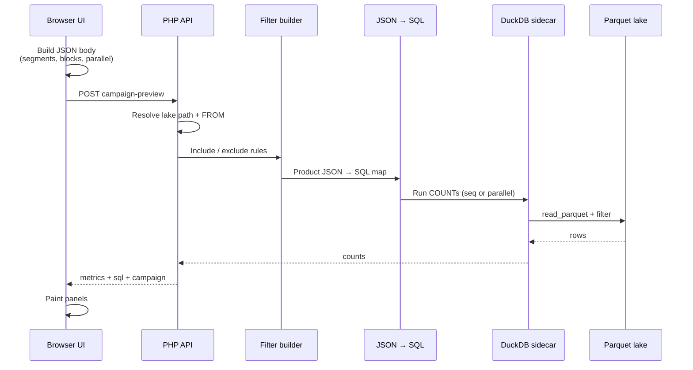
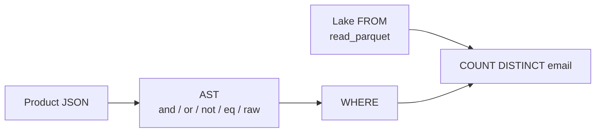

# Campaign preview — request flow

Request hits the UI → audience counts come back. In between, the JSON filter is compiled into DuckDB / Parquet SQL.

---

## 1. UI → response



| Step | What happens |
|------|----------------|
| 1 | UI builds the body: account, include/exclude segments & blocks, segment defs, parallel flag |
| 2 | `POST` campaign-preview |
| 3 | API resolves the lake path → contact `FROM` (flat hive or base+delta) |
| 4 | Campaign rules → product filter groups (OR of AND) |
| 5 | For each metric: JSON → DuckDB COUNT SQL |
| 6 | Queries run on the sidecar (`parallel=true` → concurrent) |
| 7 | Response: metrics, sql, campaign product |
| 8 | UI panels update |

**Request (short)**

```json
{
  "account_id": 1133,
  "include_segments": [9001],
  "include_block_files": [57],
  "segment_defs": { "9001": [/* rules */] },
  "parallel": true
}
```

**Response (short)**

```json
{
  "ok": true,
  "parallel": true,
  "metrics": { "final_target": 4513, "active_email": 8000000 },
  "sql": { "final_target": "SELECT COUNT(DISTINCT …)" },
  "campaign": [/* product groups */]
}
```

---

## 2. JSON → Parquet query



### Filter shapes

| Shape | Meaning |
|-------|---------|
| Flat values | All fields AND `eq` |
| AST | `{ "op", "children" / "field" }` |
| Product ESP | `[[{ type, operator, options }]]` — outer OR, inner AND |

Campaign preview uses the **product** shape.

### Product rule → SQL

| type | Becomes |
|------|---------|
| status | e.g. `email_status = 1` |
| attributes | column compare / contains / between |
| segments | expand `segment_defs[id]` → nested filter; exclude = `NOT (…)` |
| block_files | `EXISTS (SELECT 1 FROM read_parquet(block_glob) …)` |
| block_table | `"email" IN (SELECT … FROM read_parquet(…))` |
| stats | `last_emailed` / `last_sms` window |

### How SQL is assembled

1. **FROM** — from lake layout:
   - flat → `read_parquet('…/contact/**/*.parquet', …)`
   - base+delta → base LEFT JOIN latest delta (`COALESCE` status columns)
2. **Base WHERE** — `account_id = N AND is_deleted = 0`
3. **User WHERE** — product JSON → AST → SQL (`AND` / `OR` / `NOT` / leaves / raw EXISTS)
4. **COUNT** — rewrite `COUNT(*)` → `COUNT(DISTINCT NULLIF(TRIM(email), ''))`

### Code — JSON → SQL

**1) Product groups → AST**

```php
function toAst(array $groups, array $ctx): array
{
    $or = [];
    foreach ($groups as $group) {
        $and = [];
        foreach ($group as $rule) {
            $and[] = ruleToAst($rule, $ctx); // status | attributes | segments | blocks | stats
        }
        $or[] = ['op' => 'and', 'children' => $and];
    }
    return count($or) === 1 ? $or[0] : ['op' => 'or', 'children' => $or];
}
```

**2) One rule → AST leaf / raw**

```php
function ruleToAst(array $rule, array $ctx): array
{
    return match ($rule['type']) {
        'status' => [
            'datatype' => 'tinyint', 'op' => 'eq',
            'field' => 'email_status', 'value' => 1,   // status_active
        ],
        'attributes' => [
            'datatype' => 'varchar', 'op' => 'eq',     // text_attr_equals etc.
            'field' => $rule['options'][0],
            'value' => $rule['options'][1],
        ],
        'segments' => /* expand segment_defs[id] → nested AST; out_* → not */,
        'block_files' => [
            'op' => 'raw',
            'sql' => 'EXISTS (SELECT 1 FROM read_parquet(\'' . $ctx['block_file_glob'] . '\') AS bfd'
                . ' WHERE bfd.block_file_id IN (' . implode(',', $rule['options']) . ')'
                . ' AND bfd.unique_identifier = "f2")',
        ],
        'block_table' => [
            'op' => 'raw',
            'sql' => '"email" IN (SELECT bt.email FROM read_parquet(\'' . $ctx['block_table_glob'] . '\') AS bt'
                . ' WHERE bt.block_id IN (' . implode(',', $rule['options']) . '))',
        ],
        'stats' => [/* last_emailed window raw SQL */],
    };
}
```

**3) AST → WHERE string**

```php
function filterToSql(array $node): string
{
    return match ($node['op']) {
        'and', 'or' => implode(
            ' ' . strtoupper($node['op']) . ' ',
            array_map(fn ($c) => '(' . filterToSql($c) . ')', $node['children'])
        ),
        'not' => 'NOT (' . filterToSql($node['children'][0]) . ')',
        'raw' => '(' . $node['sql'] . ')',
        'eq'  => '"' . $node['field'] . '" = ' . literal($node),
        'contains' => 'CAST("' . $node['field'] . '" AS CHAR) ILIKE \'%' . escape($node['value']) . '%\'',
        // neq, gt, in, between, is_null, …
    };
}
```

**4) Full COUNT query**

```php
function toCountSql(array $input): string
{
    $ast = toAst($input['filter'], $input);
    $where = '"account_id" = ' . (int) $input['account_id']
        . ' AND "is_deleted" = 0'
        . ' AND (' . filterToSql($ast) . ')';

    $sql = 'SELECT COUNT(*) AS cnt FROM ' . $input['from'] . ' WHERE ' . $where;

    // campaign preview: unique emails
    return preg_replace(
        '/^SELECT COUNT\(\*\) AS cnt/i',
        'SELECT COUNT(DISTINCT NULLIF(TRIM("email"), \'\')) AS cnt',
        $sql,
        1
    );
}
```

### Tiny example

**JSON**

```json
[[
  { "type": "status", "operator": "status_active", "options": ["email"] },
  { "type": "block_files", "operator": "in_blockfiles", "options": [57] }
]]
```

**SQL**

```sql
SELECT COUNT(DISTINCT NULLIF(TRIM("email"), '')) AS cnt
FROM ( /* read_parquet contact / base+delta */ )
WHERE "account_id" = 1133
  AND "is_deleted" = 0
  AND (
    ("email_status" = 1)
    AND EXISTS (
      SELECT 1 FROM read_parquet('…/block_file_data/*.parquet') AS bfd
      WHERE bfd.block_file_id IN (57)
        AND bfd.unique_identifier = "f2"
    )
  );
```

---

## 3. Parallel

| Flag | Behavior |
|------|----------|
| `parallel: false` | COUNTs one-by-one |
| `parallel: true` | COUNTs inside one request run concurrently (sidecar pool) |

HTTP concurrency is separate — how many API calls hit the server at once.
